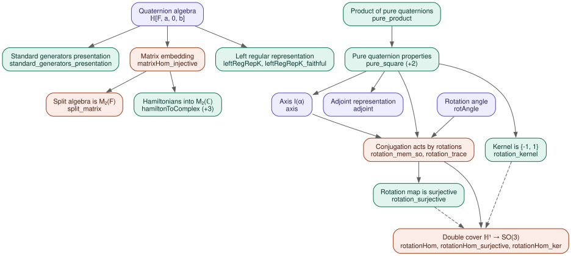

# Quaternion algebras

A Lean 4 / [Mathlib](https://github.com/leanprover-community/mathlib4) formalization of the beginnings of quaternion algebras, following Voight, *Quaternion Algebras*, Chapter 2 — quaternion algebras `(a,b/F)`, their matrix representations, and Hamilton's classical application: the double cover `ℍ¹ → SO(3)` modeling rotations of `ℝ³`.

The capstone (Voight, Corollary 2.4.21) is the rotation homomorphism `rotationHom : unitary ℍ →* SO(3)` together with

- `rotationHom_surjective : Function.Surjective rotationHom`
- `rotationHom_ker : (rotationHom.ker : Set _) = {-1, 1}`

Surjectivity follows Voight's Exercise 2.15: every `A ∈ SO(3)` fixes a unit axis, and reading the rotation angle off the image of a perpendicular unit vector fixes the orientation. The project is `sorry`-free, and every blueprint theorem depends only on the standard axioms (`propext`, `Classical.choice`, `Quot.sound`).

## Blueprint

- 📘 [Blueprint (PDF)](numina/blueprints/quaternion-algebras/quaternion-algebras.pdf) — the informal statements and proofs, each annotated with its Lean declaration
- 📄 [Blueprint (LaTeX source)](numina/blueprints/quaternion-algebras/quaternion-algebras.tex)

## Dependency graph

Solid arrows are statement-level dependencies, dashed arrows are proof-only ([Graphviz source](numina/blueprints/quaternion-algebras/dependency-graph.dot)):



## Building

```
lake exe cache get
lake build
```

## Layout

| File | Contents |
|---|---|
| [`QuaternionAlgebras/Beginnings.lean`](QuaternionAlgebras/Beginnings.lean) | Quaternion algebras and the standard generators presentation (Voight 2.2) |
| [`QuaternionAlgebras/Matrix.lean`](QuaternionAlgebras/Matrix.lean) | Matrix embeddings, the left regular representation, Hamiltonians into `M₂(ℂ)` (Voight 2.3–2.4) |
| [`QuaternionAlgebras/Rotations.lean`](QuaternionAlgebras/Rotations.lean) | Pure quaternions, the adjoint action, and the double cover `ℍ¹ → SO(3)` (Voight 2.4) |
